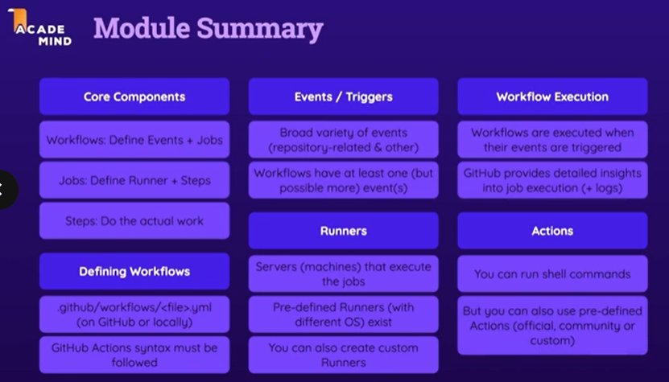

# Learning-github-actions

### My first workflow
```
name: my-first-workflow
on: workflow_dispatch
jobs:
	first-job:
		runs-on: ubuntu-latest
		steps:
			- name: Print greeding
				run: echo "Hello world!"
			- name: Print goodbye
				run: echo "bye!"
```

### NodeJS Test workflow
```
name: Test Projet
on: push
jobs:
	test: 
		runs-on: ubuntu-latest
		steps: 
			- name: Get code
				uses: actions/checkout@v4.1.1
			- name: Install NodeJS
				uses: actions/setup-node@v3
				with:
					node-version: 18
			- name: Install dependencies
				run: npm ci
			- name: Run Tests
				run: npm test
			
					
```

### Using more jobs
- These two jobs will run in parallel

```
name: Deploy Projet
on: push
jobs:
	test: 
		runs-on: ubuntu-latest
		steps: 
			- name: Get code
				uses: actions/checkout@v4.1.1
			- name: Install NodeJS
				uses: actions/setup-node@v3
				with:
					node-version: 18
			- name: Install dependencies
				run: npm ci
			- name: Run Tests
				run: npm test
    deploy:
        runs-on: ubuntu-latest
        steps: 
			- name: Get code
				uses: actions/checkout@v4.1.1
			- name: Install NodeJS
				uses: actions/setup-node@v3
				with:
					node-version: 18
			- name: Install dependencies
				run: npm ci
            - name: Build project
              run: npm run build
            - name: Deploy
              run: echo "Deploying ..."
```

- To run jobs in parallel, we should add the keyword needs.

```
name: Deploy Projet
on: push
jobs:
	test: 
		runs-on: ubuntu-latest
		steps: 
			- name: Get code
				uses: actions/checkout@v4.1.1
			- name: Install NodeJS
				uses: actions/setup-node@v3
				with:
					node-version: 18
			- name: Install dependencies
				run: npm ci
			- name: Run Tests
				run: npm test
    deploy:
        runs-on: ubuntu-latest
        needs: test
        steps: 
			- name: Get code
				uses: actions/checkout@v4.1.1
			- name: Install NodeJS
				uses: actions/setup-node@v3
				with:
					node-version: 18
			- name: Install dependencies
				run: npm ci
            - name: Build project
              run: npm run build
            - name: Deploy
              run: echo "Deploying ..."
```

### Multiple events trigger.

```
name: multi-events-workflow
on: [push,workflow_dispatch]
jobs:
	my-job:
		runs-on: ubuntu-latest
		steps:
			- name: Print greeding
				run: echo "Hello world!"
			- name: Print goodbye
				run: echo "bye!"
```

### github context 

```
name: Output information
on: workflow-dispatch
jobs:
    info:
        runs-on: ubuntu-latest
        steps:
            - name: Output github context
              run: echo "${{ toJson(github) }}"
              
```



